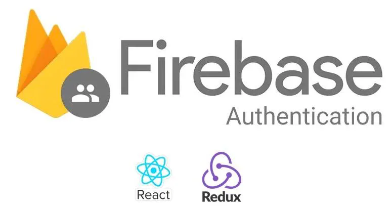

# Firebase Authentication Project



A complete authentication system built from scratch using Google Firebase framework. This project demonstrates how to implement user authentication (signup, login, logout) with Firebase Authentication and manage user data with Firestore.

## Overview

This is a React-based application that provides a full-featured authentication system using Google Firebase. The project is designed to be a learning resource and starting point for implementing authentication in React applications using Firebase services.

### Features

-   **User Registration**: Sign up new users with email and password
-   **User Login**: Authenticate existing users
-   **User Logout**: Secure session termination
-   **User Profile Management**: View and manage user information
-   **Real-time Authentication State**: Listen to authentication state changes
-   **Firestore Integration**: Store and retrieve user data from Firestore database

## Tech Stack

-   **React**: Frontend framework
-   **Firebase Authentication**: User authentication service
-   **Firestore**: NoSQL database for user data
-   **Redux**: State management (optional, for user state)

## Project Structure

```
src/
├── auth/                    # Firebase authentication utilities
│   ├── firebaseInit.js     # Firebase configuration
│   ├── getCurrentUser.js   # Get current authenticated user
│   ├── useAuthentication.js # Authentication hook
│   └── UserAuthListener.js # Auth state listener
├── users/                   # User-related components
│   ├── UsersSignup.js      # Signup component
│   ├── UsersLogin.js       # Login component
│   ├── UsersLogout.js      # Logout component
│   └── UsersHome.js        # User home page
├── features/               # Redux features
│   └── users/              # User slice for state management
└── seed/                   # Database seeding utilities
```

## Getting Started

### Prerequisites

-   Node.js and npm installed
-   A Firebase project set up in the [Firebase Console](https://console.firebase.google.com/)
-   Firebase configuration credentials

### Installation

1. Clone the repository:

```bash
git clone <repository-url>
cd firebase-authentication
```

2. Install dependencies:

```bash
npm install
```

3. Configure Firebase:

    - Create a `.env` file in the root directory
    - Add your Firebase configuration:

    ```
    REACT_APP_FIREBASE_API_KEY=your_api_key
    REACT_APP_FIREBASE_AUTH_DOMAIN=your_auth_domain
    REACT_APP_FIREBASE_PROJECT_ID=your_project_id
    REACT_APP_FIREBASE_STORAGE_BUCKET=your_storage_bucket
    REACT_APP_FIREBASE_MESSAGING_SENDER_ID=your_messaging_sender_id
    REACT_APP_FIREBASE_APP_ID=your_app_id
    ```

4. Start the development server:

```bash
npm start
```

The app will open at [http://localhost:3000](http://localhost:3000)

## Available Scripts

### `npm start`

Runs the app in the development mode.\
Open [http://localhost:3000](http://localhost:3000) to view it in your browser.

The page will reload when you make changes.\
You may also see any lint errors in the console.

### `npm test`

Launches the test runner in the interactive watch mode.\
See the section about [running tests](https://facebook.github.io/create-react-app/docs/running-tests) for more information.

### `npm run build`

Builds the app for production to the `build` folder.\
It correctly bundles React in production mode and optimizes the build for the best performance.

The build is minified and the filenames include the hashes.\
Your app is ready to be deployed!

See the section about [deployment](https://facebook.github.io/create-react-app/docs/deployment) for more information.

### `npm run eject`

**Note: this is a one-way operation. Once you `eject`, you can't go back!**

If you aren't satisfied with the build tool and configuration choices, you can `eject` at any time. This command will remove the single build dependency from your project.

## Firebase Setup

1. Go to [Firebase Console](https://console.firebase.google.com/)
2. Create a new project or select an existing one
3. Enable Authentication:
    - Go to Authentication > Sign-in method
    - Enable Email/Password authentication
4. Set up Firestore Database:
    - Go to Firestore Database
    - Create a database in test mode (or configure security rules)
5. Copy your Firebase configuration and add it to your `.env` file

## Learn More

-   [Firebase Authentication Documentation](https://firebase.google.com/docs/auth)
-   [Firestore Documentation](https://firebase.google.com/docs/firestore)
-   [React Documentation](https://reactjs.org/)
-   [Create React App Documentation](https://facebook.github.io/create-react-app/docs/getting-started)

## License

This project is open source and available for learning purposes.
